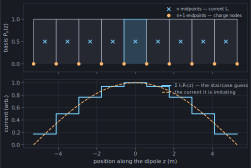
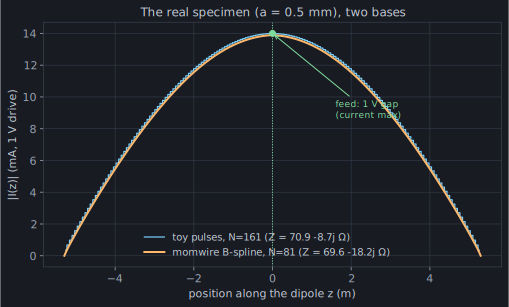
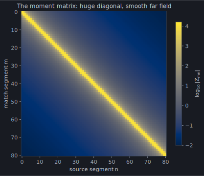

Chapter 1 left us with an impossible ask: find the *function* `I(z)`
satisfying an integral equation at *every* point on the wire. Computers do
neither of those things. The method of moments is the standard two-step
retreat to something a computer can do:

**Step 1 — expand.** Stop looking for an arbitrary function. Write the
current as a weighted sum of `N` fixed *basis functions* you chose in
advance:

```text
I(z) ≈ I₁·P₁(z) + I₂·P₂(z) + … + I_N·P_N(z)
```

The unknowns are now `N` numbers — the coefficients `Iₙ` — not a function.

**Step 2 — test.** You can't enforce the boundary condition at every point
with only `N` degrees of freedom, so enforce it `N` ways — one equation per
segment. `N` equations, `N` unknowns:

```text
Z · I = V
```

`Z[m][n]` = the field that basis function `n` produces at segment `m` — one
integral you can compute numerically, since the basis function is a *known*
shape. `V[m]` = the applied field at segment `m`. The physics is in filling
`Z`; the answer is one call to a linear solver.

The simplest possible basis is the **pulse**: chop the wire into `N`
segments; `Pₙ(z)` is 1 on segment `n`, 0 elsewhere. The current becomes a
staircase.

## The 2n+1-point grid

Here is the small idea that makes pulses actually work. Describe the wire's
`n` segments with **2n+1 points** — the `n+1` endpoints and the `n`
midpoints:



The **midpoints** carry the current — one pulse amplitude `Iₙ` each. The
**endpoints** carry the *charge*. A wire holds charge wherever its current
changes (`ρ ∝ dI/dz`, conservation of charge), and a staircase current
changes exactly at the segment joints — so a pulse deposits a little pile of
charge at each endpoint.

That split is the whole trick. The field of the wire has two parts: a
**vector-potential** part driven by the *current* (the moving charge), and a
**scalar-potential** part driven by the *charge* itself (the piles at the
endpoints). Keep them separate — current at the midpoints, charge at the
endpoints — and the naive scheme converges. (Skip the split, and matching a
pulse current against the raw kernel from chapter 1 famously does *not*
converge — a cautionary tale we'll leave to the literature.)

## The idea in forty lines

Pulses, the current/charge split, and the thin-wire kernel from chapter 1,
verbatim from the primer's own repo
([`site/figures/toy_solver.py`](https://github.com/stevenmburns/momwire/blob/main/site/figures/toy_solver.py)):

```python
import numpy as np

C0 = 299792458.0  # m/s
EPS0 = 8.8541878188e-12  # F/m
MU0 = 1.25663706127e-6  # H/m


def toy_dipole(L, a, wavelength, N):
    """Input impedance of a center-fed dipole: length L, wire radius a,
    N segments (odd, so one segment straddles the center), 1 V delta gap."""
    k = 2 * np.pi / wavelength
    omega = 2 * np.pi * C0 / wavelength
    dz = L / N

    # 2N+1 points: interleaved endpoints (even index) and midpoints (odd index).
    pts = np.linspace(-L / 2, L / 2, 2 * N + 1)
    mid = pts[1::2]  # N segment centers  — where the current lives
    lo, hi = pts[0:-1:2], pts[2::2]  # each segment's two endpoints — where charge sits

    def psi(A, B):
        """Green's-function kernel between every point in A and B, with the
        analytic self-term where two points coincide (the wire's own surface)."""
        R = np.abs(A[:, None] - B[None, :])
        same = R < dz / 1e6
        R[same] = 1.0  # avoid 0/0; overwritten below
        out = np.exp(-1j * k * R) / (4 * np.pi * R)
        out[same] = np.log(dz / a) / (2 * np.pi * dz) - 1j * k / (4 * np.pi)
        return out

    # Vector potential (from the current): both segments tested at their centers.
    Z = 1j * omega * MU0 * dz**2 * psi(mid, mid)
    # Scalar potential (from the charge): the endpoint charges of segment n,
    # differenced across the endpoints of segment m. This is the -∇φ term.
    Z += (psi(hi, hi) - psi(lo, hi) - psi(hi, lo) + psi(lo, lo)) / (1j * omega * EPS0)

    # Delta-gap feed: 1 V across the center segment.
    v = np.zeros(N, dtype=complex)
    v[N // 2] = 1.0
    I = np.linalg.solve(Z, v)
    return 1.0 / I[N // 2], I, mid  # Z_in = V / I(feed), with V = 1
```

That's a complete method-of-moments solver, and it's essentially Harrington's
classic straight-wire example (Harrington, *Field Computation by Moment
Methods*, 1968). Two lines carry the physics. `psi` is the Green's-function
kernel — chapter 1's `a²` floor, hidden here in the analytic **self-term**
`log(dz/a)/(2π dz)` for the one integral that would otherwise divide by zero
(source and observation on the same segment, the wire on top of itself). And
the four-cornered difference `psi(hi,hi) − psi(lo,hi) − psi(hi,lo) +
psi(lo,lo)` is the scalar potential: the segment's two endpoint charges,
differenced across the observation segment's two endpoints. Everything else is
the two-step retreat: `np.linalg.solve` is the whole "simultaneous
everywhere" character of the problem collapsing into linear algebra.

## The moment of truth

Run it on the real specimen — `L = 10.582`, `a = 0.0005`, `λ = 22`:

```python
Z_in, I, z_mid = toy_dipole(10.582, 0.0005, 22.0, 161)
# Z_in ≈ 70.9 - 8.7j ohms
```

momwire's B-spline solver says `69.6 − 18.3j` (and, spoiler for chapter 7, an
independent NEC-2 engine agrees). The toy's resistance is already right to
about a percent; its reactance is in the right neighbourhood and closing.
This is a *working solver*, on the actual antenna — no fattened wire, no magic
segment count. Its staircase current sits right on top of momwire's smooth
one:



Both bases agree on the whole shape, right up to the current maximum at the
**feed** (marked) — the 1 V delta gap where the generator sits. This is a
near-half-wave dipole, so the current crests at the feed and tapers to zero at
the tips: the same physical current, resolved two completely different ways.
When the method works, it *works*. (It also, we'll see in chapter 3, works
*slowly* — but let's enjoy the win first.)

## What the matrix knows

Before moving on, look at the object the toy built. Here is
`log₁₀|Z[m][n]|` for the specimen at `N = 81`:



Two things to file away:

- **The diagonal screams.** Self- and neighbour-interactions (that sharp
  kernel peak from chapter 1, and the analytic self-term) tower over
  everything else. All the delicate integration happens within a few segments
  of the diagonal.
- **Away from the diagonal, the matrix is smooth and boring.** The field of
  segment 10 at segment 60 barely differs from its field at segment 61.
  Distant interactions carry almost no independent information — the matrix
  is, in a precise sense we'll meet in Act IV, *secretly low-rank*. That
  boredom is worth a 12× speedup on real arrays; it is the entire business
  model of `hmatrix` and `arrayblock`.

## What momwire does instead

The toy uses the crudest possible basis. momwire's two dense solvers commit to
better ones:

- [`SinusoidalSolver`](https://github.com/stevenmburns/momwire/blob/v0.9.0/src/momwire/sinusoidal.py#L46)
  expands in NEC-2's three-term basis — `constant + sin(kz) + cos(kz)` per
  segment — shapes that already look like solutions of the wave equation, so a
  handful of them fit a physical current superbly (chapter 4).
- [`BSplineSolver`](https://github.com/stevenmburns/momwire/blob/v0.9.0/src/momwire/bspline.py#L173)
  expands in degree-1/2 B-splines — smooth piecewise polynomials with
  guaranteed continuity, extending cleanly to bent wires and multi-wire
  junctions (chapter 5) — and replaces our blunt per-segment testing with
  **Galerkin testing**: demand the residual be orthogonal to every basis
  function, not merely balanced segment by segment.

Why bother, when the toy already works? Because "works" and "works cheaply"
are different claims — and we quietly dodged both the question of *how many
segments that took* and the meaning of the one line we typed without comment:
the feed. Chapter 3 collects on both.
