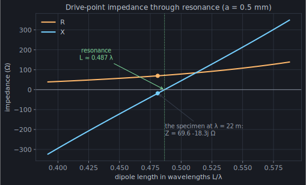

[Chapter 2](/act-1/coefficients/) ended owing two explanations: the feed line we typed without
comment, and the question of how many segments the toy's "working" answer
actually cost. Start with the feed, because it *is* the antenna's connection
to the outside world.

## What "1 volt in a gap" became

In the toy, the generator turned into exactly one line:

```python
v[N // 2] = 1.0
```

That is the **delta-gap source**: pretend the generator's 1 volt appears
entirely across the feed segment, producing an applied field there and
*nothing anywhere else*. It's the crudest workable model of a feed — no coax,
no balun, just a voltage jump — and it is what virtually every wire code uses
by default.

momwire's delta-gap is the same move. Inside
[`compute_impedance`](https://github.com/stevenmburns/momwire/blob/v0.9.0/src/momwire/sinusoidal.py#L1245),
the right-hand side is built as
[`v[fi] += -V_i / geom["seg_h"][fi]`](https://github.com/stevenmburns/momwire/blob/v0.9.0/src/momwire/sinusoidal.py#L1260)
— voltage over feed-segment length, with the sign and constants absorbed into
the solver's conventions. Same idea, a better-*tested* version of it — and, we
are about to see, the *feed* is where the toy's last ohm hides.

Solve the system, read off the current where the generator sits, and the
number every ham actually wants falls out:

```text
Z_in = V / I(feed) = 1 / I[N // 2]
```

Drive-point impedance. SWR is a one-line formula away from it; "resonance"
means its imaginary part crosses zero. When this chapter ends, we'll sweep it
across frequency and watch that happen.

## How many segments did that cost?

Chapter 2 quoted the toy at `N = 161`: `70.9 − 8.7j`, against momwire's settled
`69.6 − 18.3j`. Close on the resistance, loose on the reactance. The honest
question is what happens as we refine — and the answer is the most instructive
picture in naive MoM:


It **converges** — no window, no collapse, just a steady approach to the right
answer. But look how *unevenly*:

- **The resistance settles fast.** By a couple hundred segments `R` is within
  an ohm, and its error is clean first-order (`∝ 1/N`). Three coarse solves and
  a Richardson extrapolation land it dead on `69.6`.
- **The reactance crawls.** At `N = 481` — half a thousand unknowns — `X` is
  still only `−14.4`, several ohms shy. And it doesn't ride a clean `1/N`: the
  self-term `log(dz/a)` from chapter 2 injects a *logarithm*, so the reactance
  follows `X ≈ X∞ + (b + c·log N)/N`. Fit *that* curve (the dotted line) and
  you can extrapolate to `X∞ ≈ −17.1` from coarse data — a real rescue, pulling
  a converged number out of solves that individually look nowhere near it.

So: yes, you can get final values out of the pulse method. But count the cost.
The resistance needs a handful of solves and a one-line extrapolation. The
reactance needs *many* solves, a fitted model of its trend, and even then lands
about **an ohm short** of a good basis — because the last ohm isn't a
convergence error at all. Notice `R` extrapolates *exactly* onto momwire while
`X` stops an ohm away: an offset in the reactance alone, untouched by refining,
is the fingerprint of the **feed model**. Our bare delta-gap and momwire's
tested one simply disagree about the near-field a little, and that disagreement
lives entirely in `X`.

And brute force is no escape hatch. To reach the converged reactance *without*
extrapolating, you'd shrink the segments until `dz` approached the wire radius
— but the thin-wire kernel has its own limit, roughly `dz > 8a` for 1% accuracy
(the red line, thousands of segments out). Push past it and the kernel itself
is wrong; you'd be converging a coarse approximation to the wrong number. **The
pulse method makes you choose between a curve fit and a fortune in unknowns,
and hands you an approximate feed either way.**

## Why so slow — and the thread into Act II

Why does the reactance, of all things, crawl the worst? The clue is where we
put the charge. `X` is near-field, reactive energy — and near-field energy is
mostly the *scalar potential*, the field of those charge piles at the segment
endpoints. A pulse current is *discontinuous*, so its charge lands in
concentrated knots at the joints; the potential of a knot is a crude,
slowly-improving thing, and it dominates the reactance. Resolving it is exactly
what the extra segments are struggling to do.

That single observation is the hinge of the whole primer. Make the current
**continuous** and its charge stops piling into knots and spreads into honest,
distributed charge — the scalar potential converges, the reactance snaps into
place, and you need a *handful* of segments instead of hundreds. Every basis
momwire ships is continuous, and [Act II](/act-2/sinusoids/) is the story of what that buys:
`SinusoidalSolver` and `BSplineSolver` nail this same dipole — resistance *and*
reactance — at twenty-one unknowns, no extrapolation, in milliseconds. **You
cannot cheaply out-refine a staircase; you can only stop drawing one.**

## The payoff plot

One number is an appetizer. The answer a ham actually plots is the impedance
*across the band* — and now that solves in one call. The swept solver
([`compute_impedance_swept`](https://github.com/stevenmburns/momwire/blob/v0.9.0/src/momwire/sinusoidal.py#L1340))
takes an array of wavenumbers:

```python
import numpy as np
from momwire import SinusoidalSolver

wire = np.array([[0.0, -5.291, 0.0], [0.0, 5.291, 0.0]])
solver = SinusoidalSolver(wires=[wire], nsegs=81, wavelength=22.0,
                          wire_radius=0.0005,
                          feed_wire_index=0, feed_arclength=5.291)  # 1 V gap at the center
lams = np.linspace(18.0, 27.0, 46)                    # 46 frequencies
Z = np.asarray(solver.compute_impedance_swept(2 * np.pi / lams)).ravel()
```

46 frequencies in 65 ms, and the classic textbook curve appears — generated by
*your* specimen, not copied from a book:



Everything a ham knows by feel is in that picture, computed from first
principles: the dipole is capacitive when short, inductive when long, and
resonates (`X = 0`) at `L ≈ 0.487 λ` — a hair under a half wave, exactly the
"cut it a few percent short" rule of thumb, which for this wire is the
thickness correction made visible. Our specimen sits just below resonance at
`λ = 22 m`, which is why its reactance is −18 Ω.

## Act I, closed

You now own the core of the method of moments, honestly:

- an antenna question is an **integral equation** for the current (ch. 1),
- a **basis + testing** scheme turns it into `Z·I = V`, and even the crudest
  choice — pulses on the 2n+1-point grid — *works* (ch. 2),
- the **feed model** supplies `V`, and `Z_in = V/I(feed)` is the answer (ch. 3),
- but the naive basis converges *slowly and unevenly*, buying its final digits
  only with extrapolation or a flood of unknowns — which is why the craft of
  Act II, better bases, is not a luxury.

Act II opens inside that craft: what makes NEC's strange little
`constant + sine + cosine` basis so unreasonably effective that twenty-one
unknowns nail a dipole to a tenth of an ohm — reactance and all.

:::tip[Turn the knob yourself]
Drag the length knob of a dipole in the
[antennaknobs simulator](https://app.antennaknobs.dev/) and watch X sweep
through zero live — the sweep figure above, played as an instrument.
:::
