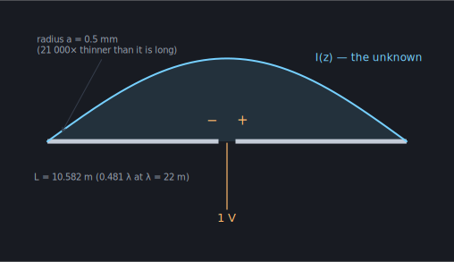
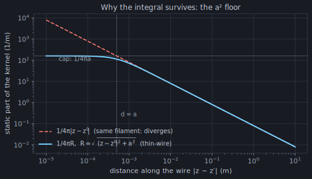

Here is the entire subject of this site, in one picture:



A straight wire, 10.582 m long and half a millimetre in radius, cut in the
middle. A generator drives **1 volt** across the cut. The question: **what
current I(z) flows along the wire?**

That's it. Everything an antenna tool tells you is downstream of this one
unknown. The drive-point impedance — the number your SWR meter argues with —
is just `1 V / I(feed)`. The radiation pattern is a weighted sum of the
current at every point. Gain, resonance, coupling to a neighbouring element:
all functionals of `I(z)`. Answer the question and you've answered
everything.

This wire is the *specimen* for the whole primer. It's momwire's own default
antenna — a dipole of length 0.481 λ at λ = 22 m (13.6 MHz), which those
constructor defaults `wavelength=22, halfdriver_factor=0.962` describe — and
it will follow us through every chapter, getting solved by progressively
better machinery.

## Why this is hard

You might hope for a formula. There isn't one — and it's worth seeing
exactly why, because the *shape* of the difficulty dictates the shape of
every solver in this field.

A current element at position `z′` produces an electric field everywhere in
space, including at every *other* point `z` on the wire. Meanwhile the wire
is (nearly) a perfect conductor, which imposes a hard rule: **the total
tangential electric field on its surface must be zero** — everywhere except
inside the gap, where the generator applies its field.

Put those two facts together. The field at `z` produced by the whole current
distribution is a sum — an integral — over contributions from every `z′`:

```text
E_scattered(z) = ∫ I(z′) · K(z, z′) dz′
```

where `K(z, z′)` (the *kernel*) encodes "how much field a unit of current at
`z′` produces at `z`". The boundary condition then says:

```text
∫ I(z′) · K(z, z′) dz′ = −E_applied(z)     for every z on the wire
```

This is **Pocklington's integral equation**. Notice what kind of beast it
is: the unknown `I(z′)` lives *inside* the integral. It isn't one equation —
it's a continuum of them, one for every observation point `z`, all coupled
to the current everywhere else. The current at the feed depends on the
current at the tips, which depends on the current at the feed. You cannot
march along the wire computing it locally; the whole distribution must be
found *at once*.

Hold onto that word "coupled" — it's why, three chapters from now, we'll be
staring at a dense matrix, and why in Act IV the cost of that matrix becomes
the villain of the story.

:::note[Where's Maxwell?]
One step upstream. `K(z, z′)` is built from the free-space Green's function
`e^(−jkR)/4πR` — the field of a point source oscillating at frequency
`k = 2π/λ` — pushed through the derivatives that turn a vector potential
into an electric field. This primer treats the kernel as a given physical
ingredient and spends its energy on what solvers *do* with it. The NEC-2
theory manual derives it in full if you want the provenance.
:::

## The thin-wire trick

There's a mathematical landmine in that integral. The kernel contains
`1/R`-type terms, where `R` is the distance between source and observation
point. When `z → z′` — the field of a piece of wire *at itself* — `R → 0`
and the kernel blows up.

The classical escape uses the wire's one merciful property: it's *thin*
(our specimen is 21 000× thinner than it is long). So:

1. Pretend the current flows along the wire's **axis**.
2. Enforce the boundary condition on the wire's **surface**, one radius away.

Source and observation point now live on different lines, and the distance
becomes

```text
R = √( (z − z′)² + a² )
```

which can never fall below the wire radius `a`. The singularity is gone —
replaced by a sharp but *finite* peak:



This `a²` under the square root is the signature of every thin-wire MoM
code on earth, and you can watch momwire apply it verbatim: the sinusoidal
solver's field evaluation computes
[`rho_eval = np.sqrt(rho_axis * rho_axis + a * a)`](https://github.com/stevenmburns/momwire/blob/v0.9.0/src/momwire/sinusoidal.py#L794)
— the perpendicular distance floored at one radius — and the B-spline
solver's module header declares
[“thin-wire kernel with a² wire-radius regularization”](https://github.com/stevenmburns/momwire/blob/v0.9.0/src/momwire/bspline.py#L14)
as a design commitment in its first lines.

Nothing is free: the peak is still *violently* sharp. For our specimen the
kernel varies on a length scale of half a millimetre near the diagonal, on
a wire ten metres long. Integrating across that peak accurately is where an
enormous amount of solver craft goes — Act II devotes a whole chapter to
it, and the toy solver we build in the next chapter will be wrecked by it
in an instructive way.

## What "solving" means now

So the problem statement is fixed: *find the function `I(z)` that makes the
scattered field cancel the applied field along the entire wire.* An unknown
**function**, pinned down by an **integral equation**.

Computers don't solve for functions. They solve for finitely many numbers.
The whole method of moments is the art of turning this integral equation
into a finite matrix equation honestly — and that's the next chapter.

## Run it yourself

The machinery of the next two chapters, applied to this exact specimen
(momwire is on PyPI: `pip install momwire`):

```python
import numpy as np
from momwire import SinusoidalSolver

wire = np.array([[0.0, -5.291, 0.0], [0.0, 5.291, 0.0]])  # the specimen, 10.582 m tip to tip
solver = SinusoidalSolver(wires=[wire], nsegs=81, wavelength=22.0,
                          wire_radius=0.0005,
                          feed_wire_index=0, feed_arclength=5.291)  # 1 V gap at the center
Z, currents = solver.compute_impedance()
print(f"Z_in = {Z.real:.1f} {Z.imag:+.1f}j ohms")   # Z_in = 69.6 -18.3j ohms
```

That `feed_arclength=5.291` — half the wire's length — is the delta-gap feed
sitting at the electrical center; it's also the default, but a feed is a
*choice* (move it and you have an off-center-fed antenna), so we name it. 69.6
− 18.3j Ω, in about 2 ms. By the end of Act I you'll know exactly what had to
happen inside that call — and you'll have built the obvious naive version
yourself and watched it work, just slowly enough to see why momwire doesn't
stop there.

:::tip[Turn the knob yourself]
The same engine runs live in the
[antennaknobs simulator](https://app.antennaknobs.dev/) — drag a dipole's
length knob and watch `Z_in` move in real time.
:::
