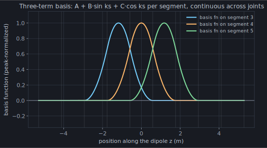
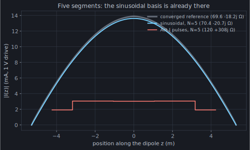

Act I closed on a promise: the pulse toy crawled because a *discontinuous*
current dumps its charge into concentrated knots at the segment joints, and the
scalar potential of those knots — where the reactance lives — converges only
first-order. Make the current **continuous** and the knots spread into honest
distributed charge. This chapter cashes that promise, with the basis NEC-2 has
used since 1981.

## The bet

Look again at what the current on a wire actually *does*. Chapter 1 turned the
antenna into an integral equation; strip it to its skeleton and the current
obeys, near enough, `(d²/ds² + k²) I ≈ source` — the **wave equation** along
the wire. And the solutions of `(d²/ds² + k²)·f = 0` are exactly `sin ks` and
`cos ks`. The current wants to be a sinusoid; it only bends away from one where
the wire ends, kinks, or is fed.

So make that the bet. On each segment, expand the current in the three shapes a
sinusoid can locally be:

```text
I_j(s) = A_j + B_j·sin k(s − s_j) + C_j·cos k(s − s_j),   |s − s_j| < Δ_j/2
```

A constant, a sine, a cosine — NEC-2's three-term basis (Burke & Poggio 1981,
Eq. 20; the momwire re-derivation is in
[`docs/sinusoidal_basis_design.md`](https://github.com/stevenmburns/momwire/blob/v0.9.0/docs/sinusoidal_basis_design.md)).
The coefficients aren't free: across each joint the basis enforces continuous
current *and* continuous slope, with Kirchhoff's current law baked into the
shapes at junctions — so there is still exactly **one unknown amplitude per
segment**, an `N×N` matrix, same size as the pulse toy. Here are three of these
basis functions, pulled straight out of
[`SinusoidalSolver`](https://github.com/stevenmburns/momwire/blob/v0.9.0/src/momwire/sinusoidal.py#L46):



Set that beside chapter 2's staircase of boxes. Those were discontinuous — a
cliff at every joint, a charge knot behind each cliff. These are smooth, they
overlap, and they meet their neighbours with matching value and slope. That
single change — continuity — is the entire difference between crawling and
converging.

## Five segments

How much does it buy? Give the specimen dipole **five segments** and read the
current off both bases:



The sinusoidal current, with *five* unknowns, is already lying on the converged
answer — `70.4 − 20.7j` against the true `69.6 − 18.3j`. The Act I pulse toy at
the same five segments returns `120 + 308j` and a current that isn't remotely
the right shape. Refine a little and the sinusoid locks on:

| N | sinusoidal | Act I pulses |
| ---: | --- | --- |
| 5 | `70.4 − 20.7j` | `120 + 308j` |
| 7 | `70.0 − 19.8j` | `103 + 207j` |
| 21 | `69.7 − 18.7j` | `80 + 53j` |
| 81 | `69.63 − 18.30j` | `72 − 1j` |

Twenty-one sinusoidal unknowns beat five hundred pulses — reactance and all,
the thing the pulse could never buy at any price. The continuous current has an
honest, distributed charge, so the scalar potential that carries the reactance
converges as fast as everything else.

## The wave equation does the integral

There's a second gift, and it's the one that makes this basis *cheap*, not just
accurate. Filling the matrix means computing the field each basis shape radiates
onto every segment — an integral of the current against chapter 1's kernel. For
a general current that integral is real work (chapter 6 is entirely about it).
But watch what the wave operator does to a sine:

```text
(d²/ds² + k²) · sin ks = 0
```

The field of a wire current runs through exactly that operator — and it
*annihilates* `sin ks` and `cos ks`. So the field of a sine-current segment, and
of a cosine-current segment, collapses to a **closed-form expression evaluated
at the two segment endpoints — no integral at all** (Burke & Poggio Eqs. 76–79).
Only the *constant* component still carries an honest integral (`k² ∫ G₀ ds'`).
Two of the three basis shapes fill themselves for free, because the basis was
chosen to be what the physics already solves. That is NEC's bet paying its
second dividend: pick the basis the operator likes, and the operator does most
of your quadrature.

## The sharpest ruler

There's a reason momwire carries this basis at all, given it also ships smoother,
more general ones (chapter 5). Because it is NEC-2's *exact* basis — same three
terms, same testing, same thin-wire kernel — it is momwire's sharpest
cross-validator. On the specimen dipole, momwire's sinusoidal solver returns
`69.63 − 18.30j`; NEC-2 (via PyNEC), on the identical geometry, returns
`69.64 − j18.21` ([`docs/convergence_analysis.md`](https://github.com/stevenmburns/momwire/blob/v0.9.0/docs/convergence_analysis.md)).
**A tenth of an ohm apart** — two independently written codes, agreeing to the
fourth significant figure. When two solvers share a basis and disagree, the
disagreement has to live in the kernel, the feed, or the junctions; matching
NEC here is what lets momwire isolate and trust every *other* piece. Chapter 7
makes that cross-validation the credibility anchor of the whole engine.

## Run it yourself

```python
import numpy as np
from momwire import SinusoidalSolver

wire = np.array([[0.0, -5.291, 0.0], [0.0, 5.291, 0.0]])
solver = SinusoidalSolver(wires=[wire], nsegs=5, wavelength=22.0,
                          wire_radius=0.0005,
                          feed_wire_index=0, feed_arclength=5.291)  # 1 V at the center
Z, alpha = solver.compute_impedance()
print(f"N=5:  Z_in = {Z.real:.1f} {Z.imag:+.1f}j ohms")   # 70.4 -20.7j — five segments!
```

If the sinusoidal basis is this good on a straight dipole, why does momwire lean
on B-splines for real antennas? Because a real antenna bends, branches, and
meets itself at junctions — and NEC's gorgeous closed-form coefficients turn
hairy the moment the wire stops being straight. Chapter 5 trades a little of this
magic for a basis that stays simple on any shape.

:::tip[Turn the knob yourself]
The [antennaknobs simulator](https://app.antennaknobs.dev/) runs this engine
live — drag a dipole's length and watch `Z_in` track resonance in real time.
:::
