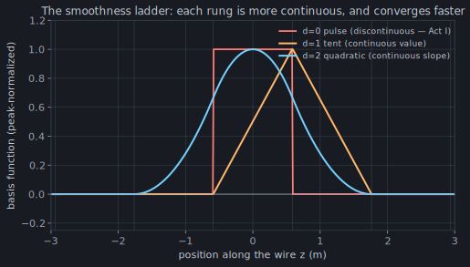

Chapter 4's sinusoidal basis is close to perfect on a straight wire — and that
`straight` is the catch. NEC's gorgeous closed-form coefficients are derived
for a segment whose neighbours continue in a line; the moment the wire bends,
branches, or meets three others at a junction, that derivation turns into
casework. momwire's workhorse basis gives up a little of the sinusoid's
per-segment cleverness to buy one thing: **it stays simple on any shape.**

## A ladder of smoothness

The idea is the plainest one in numerical analysis: on each segment, let the
current be a **polynomial of degree `d`**, and stitch the pieces together with
`d`-fold continuity. These are B-splines. Two rungs matter here, and it's worth
seeing them against Act I's pulse:



- **`d = 0`** is the pulse — a box, discontinuous at every joint. Act I.
- **`d = 1`** is the **tent**: piecewise linear, continuous in *value*. This is
  exactly the textbook "triangle" basis; momwire's degree-1 B-spline *is* the
  tent, feed conventions aside.
- **`d = 2`** is the **quadratic**: a smooth bell, continuous in value *and*
  slope.

Here is why that ladder is the *same* ladder from Act I, restated in the one
quantity that matters. The charge is `ρ ∝ dI/ds`, and the scalar potential of
that charge is where the reactance lives. So differentiate each rung:

- pulse → `dI/ds` is a train of **delta functions** (point charges — the knots
  that made Act I crawl);
- tent → `dI/ds` is piecewise **constant** (honest, distributed pulse charge);
- quadratic → `dI/ds` is itself **continuous** (the charge is now as smooth as
  the pulse's *current* was).

Every rung up the smoothness ladder is a rung up the *charge* ladder — and the
charge is what carries the reactance. That's not a coincidence; it's the whole
story of Act I told in one derivative.

## What the extra rung buys

On the specimen dipole, the convergence tracks the ladder exactly:

| N | d=1 tent | d=2 quadratic |
| ---: | --- | --- |
| 3 | `74.8 − 94.2j` | `69.9 − 18.1j` |
| 5 | `71.2 − 41.8j` | `69.8 − 18.5j` |
| 21 | `69.8 − 19.6j` | `69.7 − 18.4j` |

The quadratic is essentially **converged at three segments** — `69.9 − 18.1j`
against the true `69.6 − 18.3j` — edging out even the sinusoid, because its
charge is already smooth. The tent, one rung lower, needs a coarse handful more
before its reactance settles. Same basis family, one parameter, and you dial
accuracy against cost.

## Junctions: where splines earn their keep

A real antenna is rarely one straight wire. It bends (an inverted-V), it
branches (a top hat), it meets itself at nodes where three or more wires join.
This is where the sinusoid's closed forms give out and the spline just keeps
working — because a junction is only a boundary condition, and a polynomial
basis takes boundary conditions for breakfast.

The condition is **Kirchhoff's current law**: the currents flowing into a
junction node sum to zero. momwire enforces it as a constraint across the
basis functions that touch the node — declare the node and the basis does the
rest ([`BSplineSolver`](https://github.com/stevenmburns/momwire/blob/v0.9.0/src/momwire/bspline.py#L173)
takes a `junctions` list of the wire-ends that meet). Here it is on a T — a
downlead feeding two top arms:


The downlead arrives at the node carrying 0.25 mA; it splits into the two top
arms at 0.13 mA each. `0.25 = 0.13 + 0.13` — Kirchhoff, resolved by the basis,
not by hand. Nothing about the solver changed from the straight dipole; we
added two wires and named one node. That uniformity — one basis, any topology —
is why momwire leans on B-splines for real antennas and keeps the sinusoid as a
straight-wire cross-check.

## Run it yourself

```python
import numpy as np
from momwire import BSplineSolver

wire = np.array([[0.0, -5.291, 0.0], [0.0, 5.291, 0.0]])
solver = BSplineSolver(wires=[wire], nsegs=3, wavelength=22.0,
                       wire_radius=0.0005, degree=2,
                       feed_wire_index=0, feed_arclength=5.291)  # 1 V at the center
Z, coeffs = solver.compute_impedance()
print(f"d=2, N=3:  Z_in = {Z.real:.1f} {Z.imag:+.1f}j ohms")   # 69.9 -18.1j — three segments
```

Three quadratic segments, converged. But that innocent `compute_impedance` hides
a debt the sinusoid didn't owe: a polynomial current does **not** do its own
quadrature. Every matrix entry is now a genuine integral of the kernel against a
spline — and some of those integrals are nearly singular. Chapter 6 is about
paying that debt honestly, because "MoM is 90% quadrature engineering."

:::tip[Turn the knob yourself]
The [antennaknobs simulator](https://app.antennaknobs.dev/) runs the B-spline
engine on real, branched geometries — build an antenna that bends and watch the
current stay continuous through every joint.
:::
