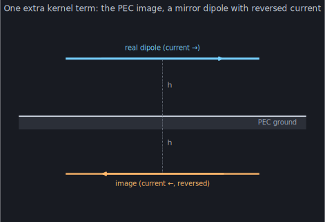

Everything in Acts I and II floated in free space. Real antennas don't: they
hang over the earth, and the ground rewrites their impedance and their pattern.
Act III adds it back, one layer of realism at a time. Start with the simplest
possible ground — a *perfect* conductor — because it costs almost nothing and it
already reproduces the effect every operator knows by feel.

## The oldest trick

A perfect electric conductor forces the tangential electric field to vanish on
its surface. You could enforce that with a wall of unknowns across the whole
plane — or you could use the trick Lord Kelvin published in 1848. Replace the
ground with a **mirror image** of the antenna, the same distance below the
plane, carrying a current arranged so the two together satisfy `E_tan = 0`
automatically. For a horizontal wire, the image current runs *backwards*:



Above the plane, the field of {antenna + image} is identical to the field of
{antenna + real ground} — and now there's no ground to mesh, just a second wire
that isn't even an unknown. Its current is dictated, point for point, by the
real antenna's. In the method of moments this is almost insultingly cheap: every
matrix entry gains **one extra kernel term** — the field of segment `n`'s *image*
evaluated at segment `m` — and nothing else changes. Same unknowns, same matrix
size. In momwire it's a single constructor argument,
[`ground_z`](https://github.com/stevenmburns/momwire/blob/v0.9.0/src/momwire/bspline.py#L173):
set the plane's height and the solver reflects every segment for you.

## Height is a knob

Once the image is in, the antenna feels its own reflection — and the feel
depends entirely on how far above the ground it sits, because the round trip
down to the image and back is a path length that slides in and out of phase:


Read it from the left. At **very low height** the image is right underneath,
its reversed current almost perfectly cancelling the real one — the radiation
resistance **collapses toward zero**. A horizontal dipole lying on a perfect
ground is a short circuit; it can't radiate, because its mirror twin is fighting
it at point-blank range. Lift it to about **0.3 λ** and the reflection comes
back in phase — `R` peaks near 94 Ω, well above free space. Keep going and the
impedance **oscillates**, each swing smaller than the last, converging on the
free-space `69.7 Ω` as the ground recedes out of reach.

That oscillation is not a numerical artifact; it is the single most practical
fact about antenna height. Every operator who has raised a dipole and watched
the SWR change has measured this curve. It's why "get it up at least a
half-wavelength" is folklore, and why a low antenna feeds so strangely.

## Run it yourself

```python
import numpy as np
from momwire import BSplineSolver

# horizontal half-wave dipole, 0.3 lambda up, over perfect ground at z = 0
h = 0.3 * 22.0
wire = np.array([[-5.291, 0.0, h], [5.291, 0.0, h]])
solver = BSplineSolver(wires=[wire], nsegs=21, wavelength=22.0, wire_radius=0.0005,
                       degree=2, ground_z=0.0,          # <- the whole ground model
                       feed_wire_index=0, feed_arclength=5.291)
Z, _ = solver.compute_impedance()
print(f"Z_in = {Z.real:.0f} {Z.imag:+.0f}j ohms")   # ~93 +5j — up from 70 in free space
```

One argument, one extra kernel term, and the dipole knows there's a floor. But
the earth is not a perfect conductor — it's dirt, imperfectly reflecting and
quietly absorbing. The mirror is real but *dim*, and its dimness is complex and
angle-dependent. [Chapter 9](/act-3/real-dirt/) replaces the perfect image with the next honest
approximation: the Fresnel reflection coefficient.
