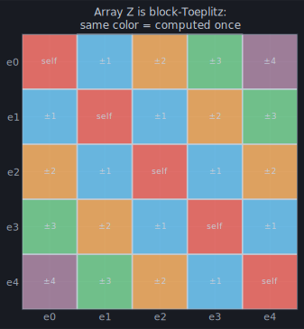
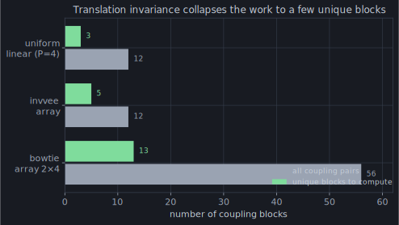

The H-matrix of chapter 12 is *geometry-blind*: it discovers low rank by
measuring how far apart two chunks of wire happen to be. But some antennas hand
you a much stronger regularity for free. An **array** is the same element,
copied and translated — a row of dipoles, a stack of bowties, a log-periodic's
graded fan. When the geometry repeats, the matrix repeats, and momwire's
[`ArrayBlockSolver`](https://github.com/stevenmburns/momwire/blob/v0.9.0/src/momwire/array_block.py)
exploits *that* instead of rediscovering it block by block.

## The matrix is a grid of blocks

Group the unknowns by element. A `P`-element array turns the impedance matrix
into a `P × P` grid of blocks: each diagonal block is an element interacting with
*itself*, each off-diagonal block is one element coupling to another.

That picture already gives away the two symmetries. First, the **self-blocks**:
identical elements have identical self-interaction, so an element's block depends
only on its *shape*, not which copy it is. Compute one dense self-block per
distinct shape class and reuse it — momwire verified the copies agree to ~2e-12.
Second, and stronger, the **coupling blocks**: in free space the interaction
between two elements depends only on their shapes and the *displacement* between
them, never their absolute position. Every block on the same Toeplitz diagonal
is therefore the *same block*. You see it in the figure as the colored stripes —
each stripe is computed once.

## From P² blocks to a handful

Put the two together — one self-block per shape, one coupling block per unique
`(shape, shape, displacement)` — and the `P(P−1)` coupling blocks collapse to a
short list of keys, each ACA-compressed once (chapter 12) and the reverse
direction filled for free by symmetry (`Z_ba = Z_ab^T`):

Fifty-six coupling pairs on a bowtie 2×4 become **thirteen** blocks to actually
compute; a uniform line collapses twelve to three. The array's own regularity
did what the H-matrix's clustering couldn't see. And the solve is cheap for a
third reason: the coupling between elements is weak — about `1e-4` of the
self-blocks — so an iterative solve preconditioned by the block-diagonal
self-blocks converges in a *handful* of steps (5 iterations on the inverted-V
array, 9 on the bowtie 2×4), landing on the dense `BSplineSolver`'s impedance to
~1e-5.

This is what lets momwire take a serious multi-element array — the kind where a
generic dense solve would be minutes and gigabytes — and answer in the time a
few unique blocks take to build. The whole `P²` grid was only ever a few
distinct numbers wearing `P²` hats.

## Toward the epilogue

Step back and look at the machine you've assembled across four acts: an integral
equation, tamed by a continuous basis; a ground, from a perfect mirror to
Sommerfeld's exact remainder; and a dense matrix, walked through by low rank and
symmetry. All of it is *Python* — readable, the spec you could re-derive. But
under the hot loops there is a second copy of the same math, compiled, and a
discipline for stopping a solve the instant a knob moves. Chapter 14 lifts that
floorboard, and then points you back at the simulator where every bit of this
runs live.
