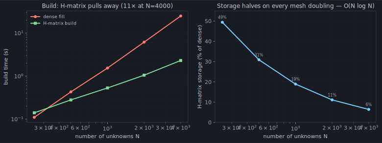

Chapter 11 ended on a hunch from chapter 2's heatmap: the matrix is dense, but
its far-from-the-diagonal regions are smooth and boring, as if they hold little
real information. That hunch has a precise, cashable form. A block of the matrix
coupling two *well-separated* chunks of wire is **low rank** — and low rank is
money.

## Boring means low rank

Take a long wire, pick sixty segments near one end and sixty near the other, and
look at the little 60×60 block of `Z` that couples them. Factor it with an SVD
and watch its singular values:

The diagonal block is **full rank** — its singular values barely budge. That's
the singular near-field from chapter 6; every segment sees its neighbours
differently, and nothing about it compresses. But the far block **collapses**:
past the second singular value it's already below any tolerance you'd care
about. A 3,600-number block is, to five digits, a **rank-two** factor.

The reason is the same smoothness that made far quadrature easy in chapter 6.
The field of a distant chunk of wire varies gently across another distant chunk —
segment 5 and segment 6 over there see this chunk almost identically — so the
rows of the block are nearly dependent. Few independent rows means low rank. The
matrix is dense, but most of it is *redundant*.

## Peeling without forming

Knowing a block is low rank, you'd like its two-number factorization without
paying to build the full block and SVD it — that SVD is itself `O(N³)`, which
would defeat the purpose. **Adaptive Cross Approximation** (ACA) does exactly
that ([`_aca.py`](https://github.com/stevenmburns/momwire/blob/v0.9.0/src/momwire/_aca.py)).
It peels the block apart one cross at a time: pick a row and a column, subtract
their outer product, look at what's left, pick the row and column of the largest
remaining entry, repeat. Each cross removes one unit of rank, and you stop when
the residual falls below tolerance — a handful of crosses for a rank-2 block.
ACA only ever samples the rows and columns it uses, so it builds the compressed
block in `O(rank × N)` **without ever forming the dense one**.

## The whole matrix, hierarchically

Do that everywhere. Partition the matrix into a tree of blocks: the ones
coupling nearby wire stay dense (they're full rank, and small), while every
block coupling well-separated pieces gets ACA'd down to a few crosses. That's a
**hierarchical matrix** ([`hmatrix.py`](https://github.com/stevenmburns/momwire/blob/v0.9.0/src/momwire/hmatrix.py)),
and it turns the whole `O(N²)` object into an `O(N log N)` one — to store, to
build, and to multiply inside an iterative solve. momwire's benchmark
([`docs/hmatrix.md`](https://github.com/stevenmburns/momwire/blob/v0.9.0/docs/hmatrix.md)):

Storage **halves on every mesh doubling** — 49% of dense at N=250 down to 6.4%
at N=4000 — at constant far-block rank ~5, the signature of `O(N log N)`. The
H-matrix *build* overtakes even the C-accelerated dense fill past N≈500 and
reaches an **11× speedup at N=4000** (2.3 s versus 25 s) that widens with N. And
the accuracy holds flat at ~1e-6 the whole way: the compression throws away
redundancy, not signal.

That's geometry paying off — blocks are cheap when the wire chunks are far
apart. But some antennas have a regularity stronger than mere distance: they're
built of *identical elements*, repeated. When the geometry itself repeats, the
matrix repeats — and chapter 13 exploits a symmetry even H-matrices leave on the
table.
