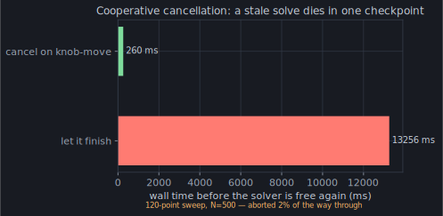

You've now followed one question — *what current flows when you put a volt across
a gap, and what does it radiate?* — from Maxwell to an array solver. Every step
was **Python**: the toy in chapter 2, the sinusoidal coefficients of chapter 4,
the Sommerfeld contours of chapter 10, the ACA crosses of chapter 12. That was a
choice, and it's the reason every chapter could link you straight into the
source. The spec *is* the implementation; you can read the whole thing.

## The compiled mirror

Readable and fast are usually a trade, and momwire's answer is to refuse it by
keeping **two copies of the same math**. The Python defines the kernels — plainly,
the way this primer quoted them. Alongside it lives a compiled C++ extension
([`_accel.py`](https://github.com/stevenmburns/momwire/blob/v0.9.0/src/momwire/_accel.py)
loads `_accelerators`) that computes the *identical* quantities — the same
static moments, the same off-edge block fills, the same Sommerfeld remainder
projection — with the loops unrolled and the GIL released. It's a mirror, not a
rewrite: the Python is the reference the C++ is checked against, and if the
extension isn't built the pure-Python path still runs, just slower. You get the
speed of the compiled kernel and the auditability of the readable one, and
they're guaranteed to agree because one is the other's oracle.

## What "production" costs

There's a last thing a solver needs before you'd hang an interactive knob on it,
and it isn't accuracy — it's the good manners to **quit**. Drag a length slider
and the solve that was running is instantly stale; finishing it is wasted work
and, worse, latency the user feels. So momwire threads a
[`CancelToken`](https://github.com/stevenmburns/momwire/blob/v0.9.0/src/momwire/_cancel.py)
— one shared flag — through the solve, and polls it at every cheap seam: each
sweep point, each ACA cross, each GMRES iteration. Flip the flag from another
thread and the solve raises `SolveAborted` at the next checkpoint instead of
grinding to the end:

A thirteen-second sweep, abandoned a quarter-second after the knob moved. That
gap — between a solver that finishes what it started and one that listens — is
the difference between a batch tool and something that feels alive under your
hand.

## Back to the knob

Which is exactly where this ends. Everything in these fourteen chapters — the
integral equation, the continuous basis that fixed the charge, the ground from
mirror to Sommerfeld, the low-rank compression and the array symmetry, the
compiled mirror and the cancel token — is the engine running behind the
[antennaknobs simulator](https://app.antennaknobs.dev/). When you drag a
dipole's length and watch its reactance cross zero in real time, that is a
`BSplineSolver` filling a matrix, splitting smooth quadrature from singular,
reflecting an image, and being cancelled and restarted faster than you can
perceive.

Go back to chapter 1 and run that first snippet again — `69.6 − 18.3j Ω, in
about 2 ms`. You know, now, everything those two milliseconds contain: the
retreat from a function to coefficients, the basis chosen so the wave equation
does half the integral, the singular self-term looked up instead of integrated,
the honest number cross-checked against NEC to a tenth of an ohm. It was never
just an impedance. It was a volt across a gap, answered all the way down.

:::tip[Turn the knob yourself]
[app.antennaknobs.dev](https://app.antennaknobs.dev/) — everything you just read,
live. Drag something and watch the physics move.
:::
