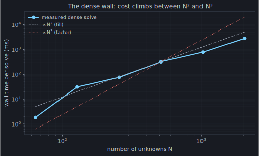
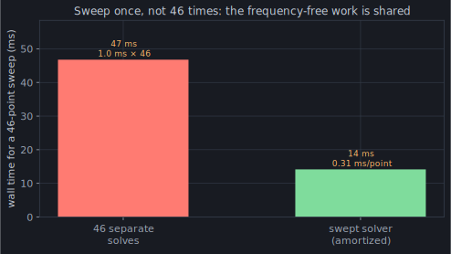

Acts I–III were about getting the answer *right*. Act IV is about getting it
*fast enough to matter*, because correctness you can't afford isn't much use.
And the thing standing in the way has been sitting in plain sight since chapter
2: the moment matrix is **dense**, and dense matrices scale viciously.

## The wall

Every one of the `N` basis functions interacts with every other, so `Z` is a
full `N × N` matrix. That costs on three axes at once. **Filling** it touches
every pair — `O(N²)` kernel evaluations. **Factoring** it to solve `Z·I = V`
is Gaussian elimination — `O(N³)`. **Storing** it is `O(N²)` complex numbers.
Push `N` up and watch:

For the specimen dipole, `N = 21` and none of this matters — the whole solve is
a millisecond. But `N` is set by *size in wavelengths*, and it climbs fast: a
big wire array, a log-periodic with dozens of elements, a structure many
wavelengths across, and `N` is in the thousands. At `N = 2048` a single solve is
already seconds and the matrix is tens of megabytes; a few doublings past that
and you're out of memory before you're out of patience. The `O(N³)` factor is
the part that eventually wins, and it wins ugly.

## Sweeps: the same wall, M times

It gets worse, because you rarely want *one* frequency. A ham wants the
impedance across a band — the [chapter 3](/act-1/the-feed/) sweep. Done naively, an `M`-point sweep
is `M` full solves: fill and factor, from scratch, `M` times.

Except most of that work doesn't depend on frequency. Remember [chapter 6](/act-2/quadrature/)'s
**static moments** — the singular integrals were called *static* precisely
because they don't move with `k`. The geometry doesn't change across a sweep
either. So momwire's swept solver
([`compute_impedance_swept`](https://github.com/stevenmburns/momwire/blob/v0.9.0/src/momwire/sinusoidal.py#L1340))
computes the frequency-independent parts **once** and reuses them at every
point:

Forty-six frequencies for well under the price of forty-six solves — each extra
point is a fraction of a cold one. And because building all those per-`k`
matrices at once could blow up memory, the swept path fills them in **batches
under a budget** (`swept_mem_mb`, default 256 MB, via
`_swept_batched_z_chunks`) — you get the amortization without the memory spike.

## But the wall is still there

Amortizing a sweep is a discount on the constant, not a change in the exponent.
A *single* solve of a genuinely large structure is still `O(N³)`, and no amount
of sweep-sharing rescues it. To actually break the wall you have to attack the
`N²` itself — to stop treating the matrix as `N²` independent numbers.

And here's the opening, and it's been visible since [chapter 2](/act-1/coefficients/). Go back and look
at that moment-matrix heatmap: a screaming diagonal, and then vast, smooth,
*boring* regions off it, where the field of one distant chunk of wire barely
varies across another. All those far-apart interactions carry almost no
independent information. The matrix is dense, but it is not *full of content* —
it is, in a precise sense, **secretly small**. [Chapter 12](/act-4/compression/) makes that precise and
cashes it in.
